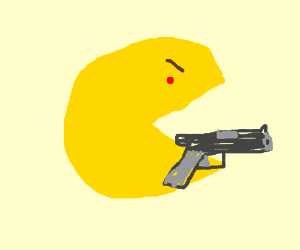
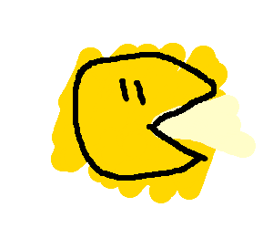

# Visió general (estratègia)
Després de ralitzar diverses proves i disenys, hem obtat per desenvolupar dos agents per separat amb comportaments diferents (**ofensiu** i **defensiu**) però
amb una part generica la qual podran fer servir qualsevol dels dos a través d'herencia.

Alhora de seleccionar quin moviment ha de realitzar un agent determinat ho farà
a través d'un algoritme **expectimax** assumint la posició més aproximada de
l'enemic en base a les creences que te les quals seran aproximacions calculades
a través de la funció **actualitzarCreences**.

```python
def genericMove(self, enemy, gameState):
"""
Comprova totes les possibles posicions succesores i que sigui legal el moviment i
es reaparteix de manera uniforme la distribucio de probabilitats i en retorna una
"""
new_belief = util.Counter()
# legalPositions is a list of tuples (x,y)
for oldPos in self.legalPositions:
    # Get the new probability distribution.
    newPosDist = util.Counter()

    # Mirem les possibles posicions succesores
    for i in [-1, 0, 1]:
        for j in [-1, 0, 1]:
            if not (abs(i) == 1 and abs(j) == 1):
                pos_pos = (oldPos[0] + i, oldPos[1] + j)
                if pos_pos in self.legalPositions:
                    newPosDist[pos_pos] = 1.0

    # Normalize to be unifom assuming the movement is random.
    newPosDist.normalize()

    # Get the new belief distibution.
    for newPos, prob in newPosDist.items():
        # Update the probabilities for each of the positions.
        new_belief[newPos] += prob * self.beliefs[enemy][oldPos]

# Normalize and update the belief.
new_belief.normalize()
self.beliefs[enemy] = new_belief
```

En quan els comportaments especifics, l'agent ofensiu l'hem disanyat a través d'una funció d'evaluació perque el seu comportament es basi en entrar i moures
per el camp enemic evitant ser atrapat, per alte banda el defensiu ha estat
disenyat per mantenirse en el camp defensant i perseguint qualsevol enemic que entri al territori.

Aquest diseny també permet que en cas de nessesitat els dos agents puguin
executar el mateix rol, per exemple, atacar els dos quan no hi hagi enemics al territori o defensar en cas que l'enemic sigui molt ofensiu.

## Acotament de les cerques
Degut a que alhora d'obtenir les distancies dels sons ens retornava masses
posicions a evaluar i que algunes d'elles eren impossibles hem decidit acotarles
amb les seguents regles-

- Si una lectura es troba en una posició en la que hauria d'estar l'enemic en forma de pacman la descartem (**prob=0.**) si no ho es, tot aixó verificant l'estat a través de la funció:

  ```python
     gameState.getAgentState().isPacman
  ```
- Comprovar si una lectura de so es troba dins el nostre rang de visió **<6**,
en aquest cas ens hauria d'apareixer dins les lectures reals, si no ho fa la podem descartar (**prob = 0.**).  


# Visió desglosada dels diferents comportaments dels agents

## Comporament general


## Comportament Ofensiu


El comportament ofensiu es basa en entrar en el territori recollir tot el menjar possible i no ser "caçat", per això la nostra funció d'evaluació es basa en trobar un equilibri entre risc i recompensa on la nostre prioritat és no ser "caçats".

Un altre factor a tenir en compte era que en ser caçat dins el territori enemic,
equivalia a perdre els punts recolectats per tant vam decidir que a cert punt
l'agent retornes al seu territori per tal de conservar aquests punts a menys que
tinguesim el **power-up** actiu.

La reflexio principal d'aquest agent i de l'agent defensiu en mode atac es basa
en prioritzar l'obtenció del **power-up** ja que facilita l'obtenció de menjar.
Quan el nostre equip ja te una puntuació mitjanament alta generalment el menjar que queda esta en posicions més complicades d'accedir, aquest es el moment en que els dos agents poden pasar a l'atac ja que sera més facil que un pugui tornar amb menjar.


## Comporament Defensiu


El comportament defensiu es basa en un equilibri entre defense i atac, es a dir,
la seva funció principal és defensar el territori dels enemics que entrin però
tambe podra atacar si es nesesari (quan no hi hagi gaire risc).

Per determinar si defensar o atacar ens basem en si hi ha algun enemic en forma de pacman, si es el cas es que l'enemic esta etacant per tant l'agent entrara en mode defensiu.

En cas d'estar en mode defensiu la funció d¡evaluacio buscara el moviment que minimitzi la distancia entre l'agent actual i l'enemic més proper, altrament en cas d'estar atacant, utilitzara la funcio de l'agent atacant i es mantindrà atacant fins que torni a tocar defensar.
